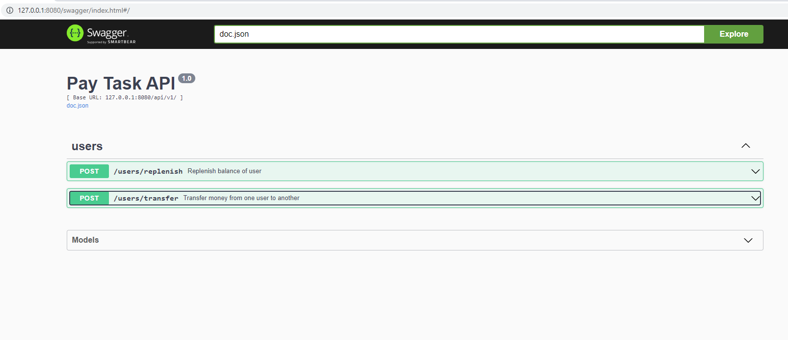

## Тестовое задание.

**Условие**:
Нужно написать веб-сервер с двумя обработчиками.
Первый обработчик пополняет баланс указанного пользователя на указанную сумму, 
то есть получает на вход 2 значения.
Второй переводит указанную сумму со счета первого пользователя на счет другого, 
в минус уходить нельзя. Он принимает на вход 3 значения:
1. id юзера (или баланса), с которого списание
2. id юзера, кому на счет поступают средства
3. сумма средств для перевода

В проекте нужна миграция для создания таблицы. Если получится по времени, то можно написать тесты.
Предусмотреть останов веб-сервера без потери обрабатываемых запросов.
Субд postgres

## Тестирование проекта
После запуска проекта по адресу `http://127.0.0.1:8080/swagger/index.html` будет доступна документация в swagger.

Внешний вид документации стандартный, представлен на скриншоте ниже

